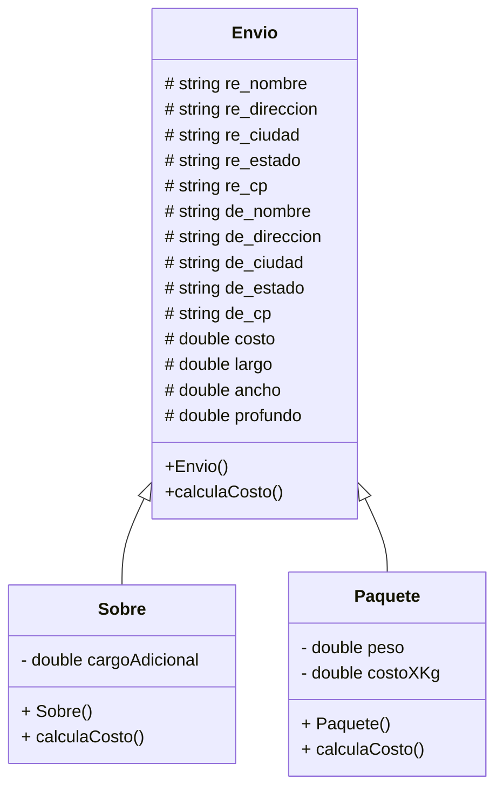

# Ejercicio - S2A1 / Herencia

Resuelve el ejercicio opcional **S2A1 - Herencia**. Revisa los requisitos en el documento ```S2A1Herencia.pdf```.

## Diagrama de clases UML

Construye aquí el **Diagrama de clases UML** de tu solución. Puedes apoyarte con el [Editor Mermaid](https://mermaid.live/).



## Sobre el repositorio

La carpeta contiene el código fuente y el archivo de construcción ```make```.

La carpeta `build` contiene el codigo binario generado por el archivo de construcción ```make```.

Consulta el archivo ```assignments/README.md``` para instrucciones sobre la compilación, ejecución y depuración de tu proyecto.
